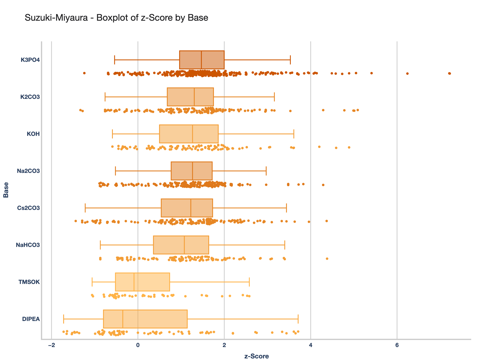
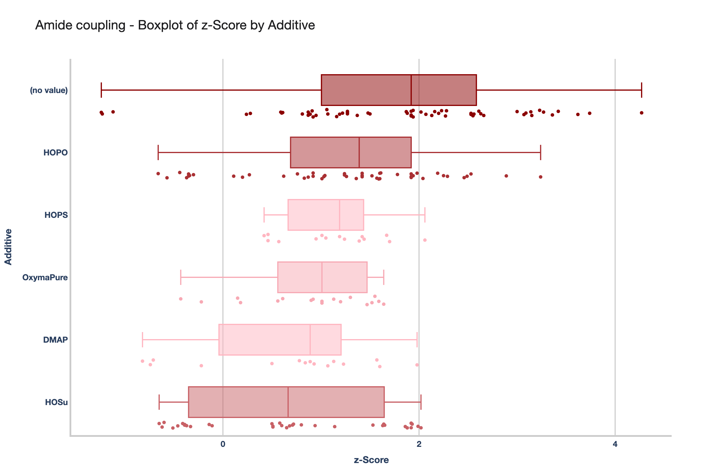

# Paper Dash Plotly - Z-Score Analysis Dashboard

[](LICENSE)
[](https://python.org)

A comprehensive Dash Plotly web application for analyzing z-score data from chemical reaction experiments. This dashboard provides interactive boxplots and filtering capabilities for exploring reagent performance across different reaction types.

## 🎯 Overview

This application is designed for chemists and researchers to analyze experimental data through interactive visualizations. It enables deep exploration of z-score distributions across various reaction parameters, helping identify optimal conditions and trends in chemical reactions.

## ✨ Features

- **📊 Interactive Boxplots**: Visualize z-score distributions by different reactant types with hover details
- **🔍 Multi-level Filtering**: Filter by reaction type, reactant type(s), Functional Group A, and Functional Group B
- **🔄 Dynamic Dropdowns**: Dropdown options update based on selected filters for intuitive navigation
- **💾 Data Export**: Download filtered data as CSV or plots as PNG for further analysis
- **📱 Responsive Design**: Modern, clean interface with Apple-inspired styling that works on all devices
- **🎯 Hover Tooltips**: Detailed information on hover with all experimental parameters
- **⚡ Performance Optimized**: Intelligent caching and data processing for smooth interactions

## 🧪 Reactant Types Available

- Additive
- Base
- Catalyst
- Coupling Reagent
- Solvent
- Functional Group A
- Functional Group B
- Ligand
- Secondary Solvent

## 🔬 Reaction Types Supported

- Buchwald-Hartwig
- Suzuki-Miyaura
- Amide Coupling
- Arylation (acidic C-H)
- Borylation (Miyaura)
- C-H Activation
- C-N Coupling
- C-O Coupling
- Condensation
- Cyclization
- Negishi (in-situ)

## 📸 Sample Visualizations

### Suzuki-Miyaura Reaction Analysis


### Amide Coupling Analysis


*These images show representative boxplot analyses for different reaction types and reactant combinations.*

## 🚀 Quick Start

### Local Development

1. **Clone the repository:**
   ```bash
   git clone <repository-url>
   cd paper_dash_plotly
   ```

2. **Install dependencies:**
   ```bash
   pip install -r requirements.txt
   ```

3. **Run the application:**
   ```bash
   python app.py
   ```

4. **Open your browser:**
   Navigate to `http://127.0.0.1:8050`

### Google Cloud Run Deployment

1. **Prerequisites:**
   - Google Cloud Platform account
   - Google Cloud SDK installed
   - Project with Cloud Run API enabled

2. **Deploy to Cloud Run:**
   ```bash
   # Set your project ID
   export GOOGLE_CLOUD_PROJECT=your-project-id

   # Deploy the container
   gcloud run deploy zscore-dashboard \
     --source . \
     --platform managed \
     --region us-central1 \
     --allow-unauthenticated \
     --port 8080
   ```

3. **Access your deployed app:**
   Your application will be available at the provided URL after deployment.

## 📊 Data Requirements

The application expects a CSV file with the following columns:

| Column | Type | Description |
|--------|------|-------------|
| `z-Score` | Numeric | Z-score values for analysis |
| `AREA_TOTAL_REDUCED` | Numeric | Area values |
| `Reaction Type` | Categorical | Type of chemical reaction |
| `ELN_ID` | String | Experiment identifier |
| `PLATENUMBER` | Numeric | Plate number |
| `Coordinate` | String | Well coordinate |
| Various reagent columns | Mixed | Additive, Base, Catalyst, etc. |

## 🏗️ Project Structure

```
paper_dash_plotly/
├── app.py              # Main Dash application entry point
├── layout.py           # UI layout components and styling
├── callbacks.py        # Interactive callback functions
├── data_utils.py       # Data loading, cleaning, and filtering
├── plot_utils.py       # Plotting and visualization utilities
├── export_boxplots.py  # Batch export functionality
├── requirements.txt    # Python dependencies
├── Procfile           # Deployment configuration
├── runtime.txt        # Python version specification
├── Dockerfile         # Container configuration
├── DEPLOYMENT.md      # Detailed deployment guide
├── assets/            # Static assets
│   ├── app.css        # Custom CSS styling
│   └── logo.png       # Application logo
├── exports/           # Generated visualizations
│   └── boxplots/      # Boxplot images by reaction type
└── z-Score Peaks with FG.csv  # Sample dataset
```

## 🛠️ Development

### Architecture

The application follows a modular architecture:
- **`app.py`**: Bootstrap and configuration
- **`layout.py`**: Visual components and UI structure
- **`callbacks.py`**: Event handlers and interactivity
- **`data_utils.py`**: Data processing and filtering logic
- **`plot_utils.py`**: Visualization generation utilities

### Key Technologies

- **Dash**: Web framework for analytical applications
- **Plotly**: Interactive plotting library
- **Pandas**: Data manipulation and analysis
- **Gunicorn**: WSGI server for production deployment
- **Google Cloud Storage**: Data hosting and retrieval

## 📝 Usage Guide

1. **Select Reaction Types**: Choose one or more reaction types from the dropdown
2. **Choose Reactant Types**: Select which reactants to analyze (Additive, Base, Catalyst, etc.)
3. **Filter Functional Groups**: Use FG A and FG B filters to narrow down results
4. **Analyze Results**: Examine the boxplot for statistical insights
5. **Export Data**: Download filtered datasets or visualizations as needed

### Example Workflow

```python
# The application automatically handles:
# 1. Data loading from local file or cloud storage
# 2. Dynamic filtering based on user selections
# 3. Interactive visualization generation
# 4. Export functionality for results
```

## 🐛 Troubleshooting

### Common Issues

- **Data not loading**: Ensure CSV file is in the project root or accessible via cloud storage
- **Plots not rendering**: Check that all dependencies are properly installed
- **Performance issues**: The app includes caching - clear cache if needed
- **Deployment failures**: Verify all files are committed to git and requirements.txt is up to date

### Debug Mode

Run with debug logging:
```bash
python app.py
```

## 🤝 Contributing

1. Fork the repository
2. Create a feature branch (`git checkout -b feature/amazing-feature`)
3. Make your changes
4. Test thoroughly with dataset
5. Submit a pull request

### Development Setup

```bash
# Install development dependencies
pip install -r requirements.txt
```

## 📄 License

This project is released under the GNU General Public License v3.0. See [LICENSE](LICENSE) for details.

## 📧 Contact

For questions, issues, or contributions, please:
- Open an issue in the repository
- Submit a pull request with improvements
- Contact the maintainers

---

**Built with ❤️ for chemical research and data analysis**

*This project was developed with the assistance of Cursor AI for enhanced productivity and code quality.* 