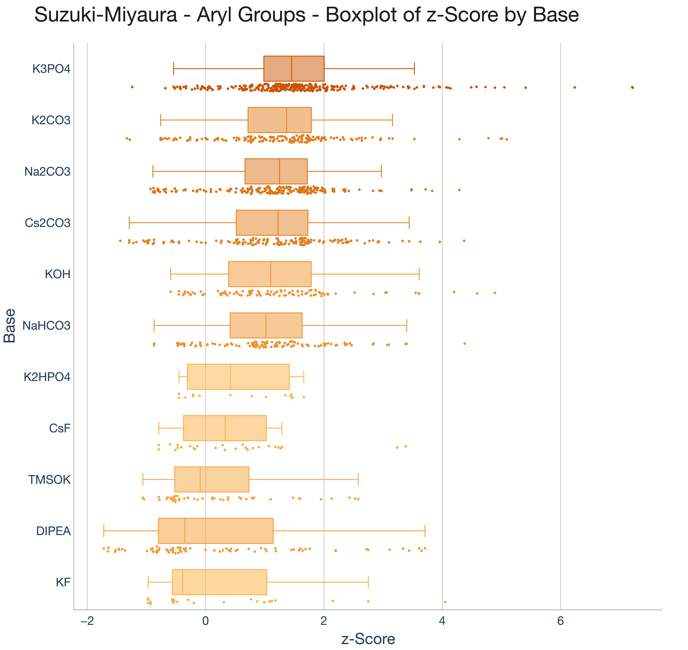
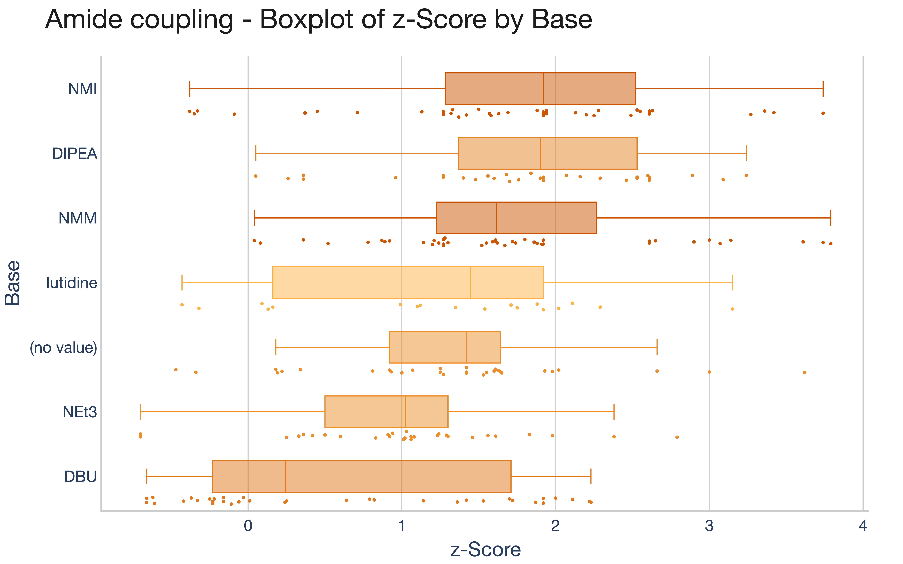

# Paper Dash Plotly - Z-Score Analysis Dashboard

[](LICENSE)
[](https://python.org)

A comprehensive Dash Plotly web application for analyzing z-score data from chemical reaction experiments. This dashboard provides interactive boxplots and filtering capabilities for exploring reagent performance across different reaction types.

## 📄 Publication

This dashboard accompanies the following publication:

> Ahlbrecht, J.; Lutz, M. D. R.; Jost, V.; Färber, M.; Bräse, S.; Wuitschik, G. *Which Reaction Conditions Work on Drug-Like Molecules? Lessons from 66,000 High-Throughput Experiments.* ACS Cent. Sci. **2026**, 12 (2), 222–232. [DOI: 10.1021/acscentsci.5c02031](https://doi.org/10.1021/acscentsci.5c02031)

## 🎯 Overview

This application is designed for chemists and researchers to analyze experimental data through interactive visualizations. It enables deep exploration of z-score distributions across various reaction parameters, helping identify optimal conditions and trends in chemical reactions.

## ✨ Features

- **📊 Interactive Boxplots**: Visualize z-score distributions by different reactant types with hover details
- **🔍 Multi-level Filtering**: Filter by reaction type, reactant type(s), Functional Group A, and Functional Group B
- **🔄 Dynamic Dropdowns**: Dropdown options update based on selected filters for intuitive navigation
- **💾 Data Export**: Download filtered data as CSV or plots as PNG for further analysis
- **📱 Responsive Design**: Modern, clean interface that works on all devices
- **🎯 Hover Tooltips**: Detailed information on hover with all experimental parameters
- **⚡ Performance Optimized**: Intelligent caching and data processing for smooth interactions

## 🧪 Reactant Types Available

- Additive
- Base
- Catalyst
- Coupling Reagent
- Solvent
- Functional Group A
- Functional Group B
- Ligand
- Secondary Solvent

## 🔬 Reaction Types Supported

- Buchwald-Hartwig
- Suzuki-Miyaura
- Amide Coupling
- Arylation (acidic C-H)
- Borylation (Miyaura)
- C-H Activation
- C-N Coupling
- C-O Coupling
- Condensation
- Cyclization
- Negishi (in-situ)

## 📸 Sample Visualizations

### Suzuki-Miyaura Reaction Analysis


### Amide Coupling Analysis


*These images show representative boxplot analyses for different reaction types and reactant combinations.*

## 🚀 Quick Start

### Local Development

1. **Clone the repository:**
   ```bash
   git clone <repository-url>
   cd paper_dash_plotly
   ```

2. **Install dependencies:**
   ```bash
   pip install -r requirements.txt
   ```

3. **Run the application:**
   ```bash
   python app.py
   ```

4. **Open your browser:**
   Navigate to `http://127.0.0.1:8050`

### Google Cloud Run Deployment

Deploy to Cloud Run from [Google Cloud Shell](https://shell.cloud.google.com):

```bash
git clone https://github.com/georg-wuitschik-Roche/zScore-App.git
cd zScore-App
bash deploy.sh
```

The script clones/updates the repo, builds the Docker image, and deploys to Cloud Run. If already cloned previously, it pulls the latest changes automatically.

Your application will be available at the provided URL after deployment.


## 📤 Uploading Your Own Data

The dashboard supports uploading your own experimental datasets for analysis. Click the **"Upload Dataset"** button in the header to load a custom CSV file.

### File Format Requirements

- **Format**: CSV (Comma-Separated Values)
- **Maximum size**: 50 MB
- **Supported encodings**: UTF-8
- **Supported delimiters**: Comma (`,`), semicolon (`;`), or tab

### Required Columns

Your uploaded CSV must contain the following columns:

| Column | Type | Description |
|--------|------|-------------|
| `z-Score` | Numeric | Z-score values for analysis (can use `.` or `,` as decimal separator) |
| `AREA_TOTAL_REDUCED` | Numeric | Area values for normalization |
| `Reaction Type` | Categorical | Type of chemical reaction (e.g., "Buchwald-Hartwig") |
| `ELN_ID` | String | Experiment identifier |
| `PLATENUMBER` | Numeric | Plate number |
| `Coordinate` | String | Well coordinate (e.g., "A1", "B12") |
| `Base` | String | Base reagent used |
| `Catalyst` | String | Catalyst reagent used |
| `Solvent` | String | Solvent used |
| `Ligand` | String | Ligand used |
| `FG A` | String | First functional group identifier |
| `FG B` | String | Second functional group identifier |
| `FG_sorted` | String | Sorted, concatenated functional group pair (e.g., "COOH, NH2") |

### How Uploaded Data is Processed

- **Replacement behavior**: Uploaded data **replaces** the built-in dataset for the duration of your session. The analysis is performed exclusively on your uploaded data, not side-by-side or merged with the built-in dataset.
- **Privacy**: Uploaded data is held in browser memory for the duration of your session. It transits through the server for processing but is **never stored to disk, logged, or transmitted** to any external service. When you close the tab or reset, the data is gone.
- **Full functionality**: All filtering, visualization, and export features work identically on uploaded data as they do on the built-in dataset.
- **Reset**: Click the **"Reset"** button to return to analyzing the built-in dataset.

### Interpreting Results

After uploading your data:
1. The reaction type dropdown will update to show only the reaction types present in your dataset
2. Functional group filters will reflect the groups available in your data
3. Boxplots will display z-score distributions calculated from your uploaded experiments
4. Export options will generate files based on your filtered data

## 🏗️ Project Structure

```
paper_dash_plotly/
├── app.py              # Main Dash application entry point
├── layout.py           # UI layout components and styling
├── callbacks.py        # Interactive callback functions
├── data_utils.py       # Data loading, cleaning, and filtering
├── plot_utils.py       # Plotting and visualization utilities
├── export_boxplots.py  # Batch export functionality
├── requirements.txt    # Python dependencies
├── Procfile           # Deployment configuration
├── runtime.txt        # Python version specification
├── Dockerfile         # Container configuration
├── DEPLOYMENT.md      # Detailed deployment guide
├── assets/            # Static assets
│   ├── app.css        # Custom CSS styling
│   └── logo.png       # Application logo
├── exports/           # Generated visualizations
│   └── boxplots/      # Boxplot images by reaction type
└── z-Score Peaks with FG.csv  # Sample dataset
```

## 🛠️ Development

### Architecture

The application follows a modular architecture:
- **`app.py`**: Bootstrap and configuration
- **`layout.py`**: Visual components and UI structure
- **`callbacks.py`**: Event handlers and interactivity
- **`data_utils.py`**: Data processing and filtering logic
- **`plot_utils.py`**: Visualization generation utilities

### Key Technologies

- **Dash**: Web framework for analytical applications
- **Plotly**: Interactive plotting library
- **Pandas**: Data manipulation and analysis
- **Gunicorn**: WSGI server for production deployment
- **Google Cloud Storage**: Data hosting and retrieval

## 📝 Usage Guide

1. **Select Reaction Types**: Choose one or more reaction types from the dropdown
2. **Choose Reactant Types**: Select which reactants to analyze (Additive, Base, Catalyst, etc.)
3. **Filter Functional Groups**: Use FG A and FG B filters to narrow down results
4. **Analyze Results**: Examine the boxplot for statistical insights
5. **Export Data**: Download filtered datasets or visualizations as needed

### Example Workflow

```python
# The application automatically handles:
# 1. Data loading from local file or cloud storage
# 2. Dynamic filtering based on user selections
# 3. Interactive visualization generation
# 4. Export functionality for results
```

## 🐛 Troubleshooting

### Common Issues

- **Data not loading**: Ensure CSV file is in the project root or accessible via cloud storage
- **Plots not rendering**: Check that all dependencies are properly installed
- **Performance issues**: The app includes caching - clear cache if needed
- **Deployment failures**: Verify all files are committed to git and requirements.txt is up to date

### Debug Mode

Run with debug logging:
```bash
python app.py
```

## ⚠️ Known Limitations 

- The dataset does not contain molecule structures due to the confidentiality of the synthesized structures. Therefore the dataset cannot be searched by structural similarity.

## 🔮 Future Development

The following features are under consideration for future development:

- **Open source structure datasets**: Integrating publicly available chemical structure datasets to enable structure-aware analysis without confidentiality constraints
- **Structural similarity search**: Implementing molecular fingerprint-based similarity searching to allow users to find reactions with structurally similar substrates
- **Flexible upload handling**: Allowing users to choose how uploaded data interacts with the built-in dataset (e.g., replace, merge side-by-side, or compare)

Community contributions toward these features are welcome. Please open an issue to discuss implementation approaches.

## 🤝 Contributing

1. Fork the repository
2. Create a feature branch (`git checkout -b feature/amazing-feature`)
3. Make your changes
4. Test thoroughly with dataset
5. Submit a pull request

### Development Setup

```bash
# Install development dependencies
pip install -r requirements.txt
```

## 📄 License

This project is released under the GNU General Public License v3.0. See [LICENSE](LICENSE) for details.

## 📧 Contact

For questions, issues, or contributions, please:
- Open an issue in the repository
- Submit a pull request with improvements
- Contact the maintainers

---

**Built with ❤️ for chemical research and data analysis mostly by Jesse Ahlbrecht and by Georg Wuitschik with data provided by Team RoSL 
Roche Pharma Research and Early Development, Roche Innovation Center Basel**

*This project was developed with the assistance of Cursor AI for enhanced productivity and code quality.* 
